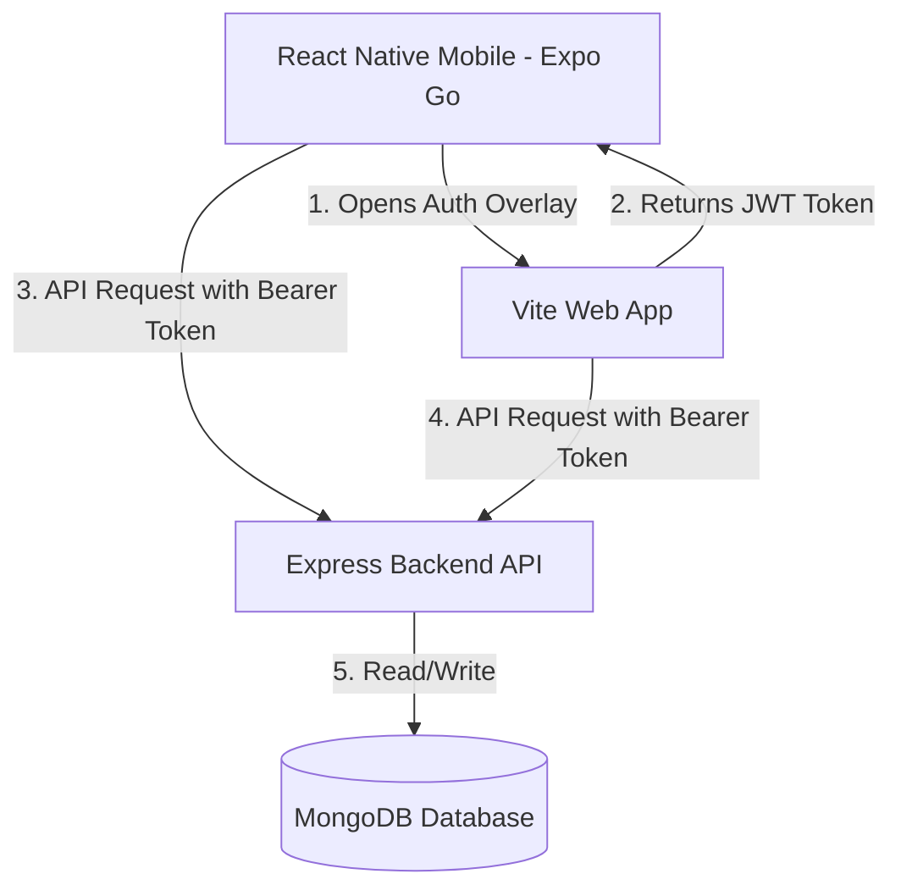

# SpendWise 🪙 — Personal Finance Tracker

SpendWise is a premium, full-stack personal finance tracker designed to help users log income/expenses, visualize budget distributions, analyze historical financial trends, and make informed financial decisions. 

The application is structured as a monorepo consisting of:
1. **Express & MongoDB Backend API** (`backend/`)
2. **Vite & Tailwind CSS Web Client** (`frontend/`)
3. **React Native & Expo Mobile Client** (`mobile/`)

---

## 🏗️ System Architecture & Data Flow



---

## 📁 Project Directory Structure

```
SpendWise/
├── backend/                  # Express REST API
│   ├── src/
│   │   ├── config/           # Database configuration
│   │   ├── controllers/      # Route handler logic
│   │   ├── middleware/       # Authentication & security middleware
│   │   ├── models/           # Mongoose schemas (User, Expense)
│   │   ├── routes/           # Express routers (auth, expense, user)
│   │   ├── utils/            # Helper scripts
│   │   ├── app.js            # Server entry point
│   │   └── .env              # Backend local environment variables
│   └── package.json          # Node dependencies & dev scripts
├── frontend/                 # Vite React Web Client
│   ├── src/
│   │   ├── components/       # Custom reusable UI components
│   │   ├── pages/            # View pages (Login, Dashboard, Analytics, etc.)
│   │   ├── services/         # Axios API connection
│   │   ├── utils/            # Auth token handlers
│   │   ├── App.jsx           # React app router config
│   │   └── main.jsx          # DOM entry point
│   ├── .env                  # Web local environment variables
│   └── package.json          # Web dependencies & config
└── mobile/                   # React Native Expo Mobile Client
    ├── src/
    │   ├── app/              # Expo router routes ((auth), (app))
    │   ├── components/       # Reusable React Native components
    │   ├── constants/        # Theme, colors, styles
    │   ├── context/          # Auth context state provider
    │   ├── services/         # Axios API configuration
    │   └── utils/            # Secure storage token handlers
    ├── app.json              # Expo configuration metadata
    ├── .env                  # Mobile local environment variables
    └── package.json          # Expo dependencies & config
```

---

## 🛠️ Technology Stack & Dependencies

Each module is built with dedicated technologies chosen for performance, responsiveness, and clean codebase organization:

### 1. Backend (`backend/`)
* **Express.js (`^5.2.1`)**: Fast, unopinionated web framework for Node.js.
* **Mongoose (`^9.6.3`)**: Elegant MongoDB object modeling for node.js.
* **JSON Web Tokens (`jsonwebtoken @ ^9.0.3`)**: Secure transmission of auth status.
* **BCrypt.js (`bcryptjs @ ^3.0.3`)**: Salted password hashing.
* **Cors (`^2.8.6`)**: Cross-Origin Resource Sharing middleware.
* **Helmet (`^8.2.0`)**: Secure HTTP header configuration.
* **Nodemon (`^3.1.14`)**: Automatically restarts the server during local development.

### 2. Frontend (`frontend/`)
* **React (`^19.2.4`) & React DOM (`^19.2.4`)**: Core UI library.
* **Vite (`^8.0.4`)**: Fast and modern frontend tooling/bundler.
* **Tailwind CSS (`v4.2.2`)**: A utility-first CSS framework for modern, responsive designs.
* **React Router DOM (`^7.14.1`)**: SPA client-side routing.
* **Recharts (`^3.8.1`)**: Redefined chart library for data visualization.
* **Axios (`^1.15.0`)**: Promise-based HTTP client for web requests.

### 3. Mobile Client (`mobile/`)
* **Expo (`~56.0.9`)**: Framework for universal React Native applications.
* **Expo Router (`~56.2.9`)**: File-based router for native apps.
* **React Native Reanimated (`4.3.1`)**: Fluent 60fps micro-animations.
* **React Native Gesture Handler (`~2.31.1`)**: Smooth native touch interactions.
* **NativeWind (`^4.2.5`) & Tailwind CSS (`^3.4.19`)**: Universal CSS styling utility.
* **Expo Secure Store (`^56.0.4`)**: Encrypted key-value local storage on device.
* **Expo Web Browser (`~56.0.5`)**: Provides access to system web browsers for auth flows.
* **Axios (`^1.17.0`)**: Handles API calls on mobile.

---

## 🗄️ Database Schemas (Mongoose)

### User Schema (`User.js`)
Stores user profiles and login provider details.
```typescript
{
  name: { type: String, required: true },
  email: { type: String, required: true, unique: true },
  password: { type: String }, // Optional (empty for Google accounts)
  provider: { type: String, enum: ['local', 'google'], default: 'local' },
  googleId: { type: String }, // Optional (set on Google Sign-in)
  photoUrl: { type: String },
  emailVerified: { type: Boolean, default: false },
  dateOfBirth: { type: Date }
}
```

### Expense Schema (`Expense.js`)
Tracks the financial transactions of users.
```typescript
{
  amount: { type: Number, required: true },
  category: { type: String, required: true },
  date: { type: Date, default: Date.now },
  description: { type: String },
  type: { type: String, enum: ['INCOME', 'EXPENSE'], required: true },
  user: { type: Schema.Types.ObjectId, ref: 'User', required: true }
}
```

---

## 🗝️ Authentication System

SpendWise implements two authentication modes:
1. **Local Authentication**: Salted hashing with `bcryptjs` and session tokens generated with `jsonwebtoken`.
2. **Google OAuth 2.0 Web Bridge**: 
   * Google restricts raw IP addresses (`192.168.x.x`) and custom schemes (`exp://`) on their Google Sign-In console.
   * To bypass this constraint without native local builds, the mobile app opens the web client's login page inside an in-app browser (`expo-web-browser`).
   * Once Google logs the user in on the web page, the web page returns the user session JWT token to the mobile client using a deep link (`exp://.../--/login-success?token=JWT_TOKEN`).

---

## ⚙️ Setting Up Environment Files

Make sure to create and configure the `.env` files in all three workspaces:

### 1. Backend Config: `backend/src/.env`
```env
PORT=5000
MONGO_URI=mongodb+srv://<username>:<password>@cluster.mongodb.net/spendwise
JWT_SECRET=your_jwt_signing_secret_here
GOOGLE_CLIENT_ID=44771153041-e8t2c9n15mog0drgjuddp0tb1i3art5h.apps.googleusercontent.com
GOOGLE_ANDROID_CLIENT_ID=44771153041-tl9m494m9og73kirj0b6bpamgs86p4um.apps.googleusercontent.com
```

### 2. Frontend Config: `frontend/.env`
```env
# For local testing, change "localhost" to your PC's IP (e.g. 192.168.254.5)
VITE_API_URL=http://192.168.254.5:5000/api
VITE_GOOGLE_CLIENT_ID=44771153041-e8t2c9n15mog0drgjuddp0tb1i3art5h.apps.googleusercontent.com
```

### 3. Mobile Config: `mobile/.env`
```env
# Point to your computer's local network IP address
EXPO_PUBLIC_API_URL=http://192.168.254.5:5000/api
EXPO_PUBLIC_WEB_URL=http://192.168.254.5:5173
```

---

## 🚀 Running the Project Locally

### Prerequisites
* Install Node.js (v18 or newer recommended).
* Connect your PC and mobile device to the **same Wi-Fi network**.

### Step 1: Start the Backend
```bash
cd backend
npm install
npm run dev
```
*Port:* Binds to `5000` (or `PORT` from `.env`).

### Step 2: Start the Web App
```bash
cd frontend
npm install
npm run dev -- --host
```
*Note:* The `--host` flag ensures your mobile device can access the frontend dev server via your PC's network IP (e.g., `http://192.168.254.5:5173`).

### Step 3: Run the Mobile Client
```bash
cd mobile
npm install
npm run start
```
* Scan the QR code displayed in the terminal using the **Expo Go** application (Android) or system Camera app (iOS).
* The app will load directly into the Expo Go container on your phone.

---

## ☁️ Deployment Configurations

### 1. Deployed Backend (Render / Fly.io)
When pushing to GitHub, you can link the repository to a hosting platform like Render:
* **Root Directory**: `backend`
* **Build Command**: `npm install`
* **Start Command**: `npm start`
* **Environment Variables**: Add your production `MONGO_URI`, `JWT_SECRET`, and `GOOGLE_CLIENT_ID` in the hosting dashboard.
* **CORS**: Express binds to `process.env.PORT` automatically.

### 2. Deployed Frontend (Vercel)
* **Root Directory**: `frontend`
* **Build Command**: `npm run build`
* **Output Directory**: `dist`
* **Environment Variables**: Set `VITE_API_URL` to your newly deployed production backend URL, and `VITE_GOOGLE_CLIENT_ID` to your web client ID.

### 3. Deployed Mobile App (EAS Cloud Build)
Because Windows environments can encounter C++ standard library compilation errors during local NDK compilations, we build the application in the cloud:
1. Install EAS CLI: `npm install -g eas-cli`
2. Create/Log in to your Expo account: `eas login`
3. Setup EAS Project: `eas project:init`
4. Trigger Cloud Compile:
   ```bash
   npx eas build --platform android --profile preview
   ```
5. Expo's secure cloud server compiles the binary (`.apk`) and provides a download QR code.
