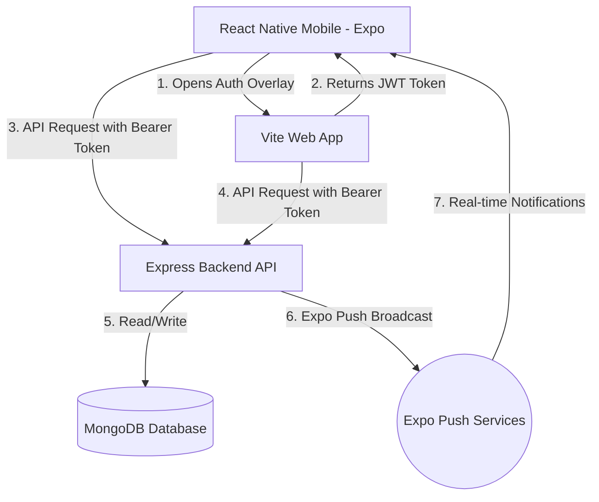

# SpendWise 🪙 — Personal Finance Tracker

SpendWise is a premium, full-stack personal finance tracker designed to help users log income/expenses, visualize budget distributions, analyze historical financial trends, and make informed financial decisions. 

The application is structured as a monorepo consisting of:
1. **Express & MongoDB Backend API** (`backend/`)
2. **Vite & Tailwind CSS Web Client** (`frontend/`)
3. **React Native & Expo Mobile Client** (`mobile/`)

---

## 🏗️ System Architecture & Data Flow



---

## 📁 Project Directory Structure

```
SpendWise/
├── backend/                  # Express REST API
│   ├── src/
│   │   ├── config/           # Database configuration
│   │   ├── middleware/       # Auth (JWT) & Admin check middleware
│   │   ├── models/           # Mongoose schemas (User, Expense, Notification, Stats)
│   │   ├── routes/           # REST endpoints (auth, expense, user, admin, download, notification)
│   │   ├── utils/            # Helper scripts (seeding admins, cleaning users)
│   │   ├── app.js            # Server entry point
│   │   └── .env              # Backend local environment variables
│   └── package.json          # Node dependencies & dev scripts
├── frontend/                 # Vite React Web Client
│   ├── public/               # Static assets & version.json (OTA app update config)
│   ├── src/
│   │   ├── components/       # Custom reusable UI components & layout templates
│   │   ├── pages/            # Web pages (Login, Dashboard, Analytics, Admin Dashboard, etc.)
│   │   ├── services/         # Axios API connection
│   │   ├── utils/            # Auth token handlers & JWT decoding
│   │   ├── App.jsx           # React app router config
│   │   └── main.jsx          # DOM entry point
│   ├── .env                  # Web local environment variables
│   └── package.json          # Web dependencies & config
└── mobile/                   # React Native Expo Mobile Client
    ├── src/
    │   ├── app/              # Expo router screens ((auth), (app)/dashboard, profile, etc.)
    │   ├── components/       # Reusable components (Notification Modal, Admin Portal Modal)
    │   ├── constants/        # Theme, colors, styles
    │   ├── context/          # Auth context & global state provider
    │   ├── services/         # Axios API configuration
    │   └── utils/            # Secure storage token handlers & push notifications manager
    ├── app.json              # Expo configuration metadata & permissions
    ├── .env                  # Mobile local environment variables
    └── package.json          # Expo dependencies & config
```

---

## 🛠️ Technology Stack & Dependencies

Each module is built with dedicated technologies chosen for performance, responsiveness, and clean codebase organization:

### 1. Backend (`backend/`)
* **Express.js (`^5.2.1`)**: Fast, unopinionated web framework for Node.js.
* **Mongoose (`^9.6.3`)**: Elegant MongoDB object modeling.
* **JSON Web Tokens (`jsonwebtoken @ ^9.0.3`)**: Session security and role claims.
* **BCrypt.js (`bcryptjs @ ^3.0.3`)**: Salted password hashing.
* **Cors (`^2.8.6`)**: Cross-Origin Resource Sharing middleware.
* **Helmet (`^8.2.0`)**: Secure HTTP header configurations.

### 2. Web Frontend (`frontend/`)
* **React (`^19.2.4`) & React DOM (`^19.2.4`)**: Core UI library.
* **Vite (`^8.0.4`)**: Fast modern frontend bundler.
* **Tailwind CSS (`v4.2.2`)**: Utility-first CSS framework for custom styling.
* **Recharts (`^3.8.1`)**: Dynamic financial chart visualizations.
* **React Router DOM (`^7.14.1`)**: SPA client-side routing and protected routes.

### 3. Mobile Client (`mobile/`)
* **Expo (`~56.0.11`)**: Framework for universal React Native applications.
* **Expo Router (`~56.2.10`)**: File-system-based router.
* **Expo Notifications (`~56.0.17`)**: Handles system permissions and push tokens.
* **Expo File System (`~18.0.7`)**: Manages in-app downloads of update packages.
* **Expo Intent Launcher (`~12.0.4`)**: Opens local APK installers on Android.
* **NativeWind (`^4.2.5`) & Tailwind CSS (`^3.4.19`)**: Universal CSS styling utility.

---

## 🗄️ Database Schemas (Mongoose)

### 1. User Schema (`User.js`)
Stores user profiles, login credentials, device push tokens, and roles.
```typescript
{
  name: { type: String, required: true },
  email: { type: String, required: true, unique: true },
  password: { type: String }, // Optional (empty for Google accounts)
  provider: { type: String, enum: ['local', 'google'], default: 'local' },
  googleId: { type: String },
  photoUrl: { type: String },
  emailVerified: { type: Boolean, default: false },
  dateOfBirth: { type: Date },
  role: { type: String, enum: ['user', 'admin'], default: 'user' }, // Controls Admin access
  pushTokens: [String], // Array of device tokens for push alerts
  lastSeenAt: { type: Date } // Tracks user activity
}
```

### 2. Expense Schema (`Expense.js`)
Tracks the financial transactions of users.
```typescript
{
  amount: { type: Number, required: true },
  category: { type: String, required: true },
  date: { type: Date, default: Date.now },
  description: { type: String },
  type: { type: String, enum: ['INCOME', 'EXPENSE'], required: true },
  user: { type: Schema.Types.ObjectId, ref: 'User', required: true }
}
```

### 3. Notification Schema (`Notification.js`)
Logs admin-broadcasted push messages.
```typescript
{
  title: { type: String, required: true },
  body: { type: String, required: true },
  sentAt: { type: Date, default: Date.now },
  sentBy: { type: Schema.Types.ObjectId, ref: 'User' },
  recipientCount: { type: Number, default: 0 }
}
```

### 4. Stats Schema (`Stats.js`)
Key-value store for app download tracking and installs.
```typescript
{
  key: { type: String, required: true, unique: true },
  value: { type: Number, default: 0 }
}
```

---

## 🗝️ Core Subsystems & Advanced Features

### 1. Web & Mobile Admin Portal
Admins (with `role === 'admin'`) can access comprehensive dashboards on both platforms:
* **Web Portal:** Includes stats cards, a searchable users list showing account creation details and activity, and a form to broadcast push notifications.
* **Mobile Portal:** Secured behind a role check, accessible under **Profile > Admin Portal**. Admins can view statistics, broadcast real-time notifications to all users, and search the user directory directly from their phone.

### 2. Global Push Notifications
* Uses **Expo Push API** for broadcasting real-time notifications.
* Mobile clients register push tokens on login using the `expo-notifications` module.
* A **Notification Bell** icon (🔔) is integrated into the dashboard header on mobile. Tapping it displays a bottom-sheet modal with a history feed of recent broadcasts.

### 3. In-App Auto-Update System
Avoids requiring manual updates via a browser:
* On launch, the app reads a `/version.json` file hosted on the Vercel web server.
* If a new version is detected (`versionCode` on server > `CURRENT_VERSION_CODE` in app), an **"Update Available"** alert is displayed.
* Clicking **"Update Now"** downloads the latest APK file in the background (showing a progress bar modal).
* Once the download is complete, the app automatically triggers the Android system installer to update the app immediately using `expo-intent-launcher` (requires `REQUEST_INSTALL_PACKAGES` permission).

---

## ⚙️ Setting Up Environment Files

Configure the `.env` files in all three workspaces:

### 1. Backend Config: `backend/src/.env`
```env
PORT=5000
MONGO_URI=mongodb+srv://<username>:<password>@cluster.mongodb.net/spendwise
JWT_SECRET=your_jwt_signing_secret_here
GOOGLE_CLIENT_ID=google_web_oauth_client_id
GOOGLE_ANDROID_CLIENT_ID=google_android_oauth_client_id
FRONTEND_URL=https://myspendwise-finance.vercel.app # Points to your hosted web client
```

### 2. Frontend Config: `frontend/.env`
```env
VITE_API_URL=http://<YOUR_PC_IP>:5000/api # Point to local IP for dev testing
VITE_GOOGLE_CLIENT_ID=google_web_oauth_client_id
```

### 3. Mobile Config: `mobile/.env`
```env
EXPO_PUBLIC_API_URL=http://<YOUR_PC_IP>:5000/api
EXPO_PUBLIC_WEB_URL=http://<YOUR_PC_IP>:5173 # Web dev server
```

---

## 🚀 Running the Project Locally

### Step 1: Start the Backend
```bash
cd backend
npm install
npm run dev
```

### Step 2: Start the Web App
```bash
cd frontend
npm install
npm run dev -- --host
```

### Step 3: Run the Mobile Client
```bash
cd mobile
npm install
npm run start
```
Scan the QR code in your terminal using **Expo Go** (or build a native preview using `./gradlew assembleRelease` inside `android` for APK verification).

---

## 🛠️ Utility Scripts
We have included useful automation scripts inside the `backend/src/utils/` folder:
* **Seed Admin:** `node src/utils/seedAdmin.js` (promotes a specific email to `'admin'`).
* **Clear Users:** `node src/utils/clearUsers.js` (wipes the users collection to reset user data).
* **List Users:** `node src/utils/list_users.js` (lists all database users, roles, and last-seen activity).
* **Make Admin:** `node src/utils/makeAdmin.js` (quickly promotes a user to admin role).
